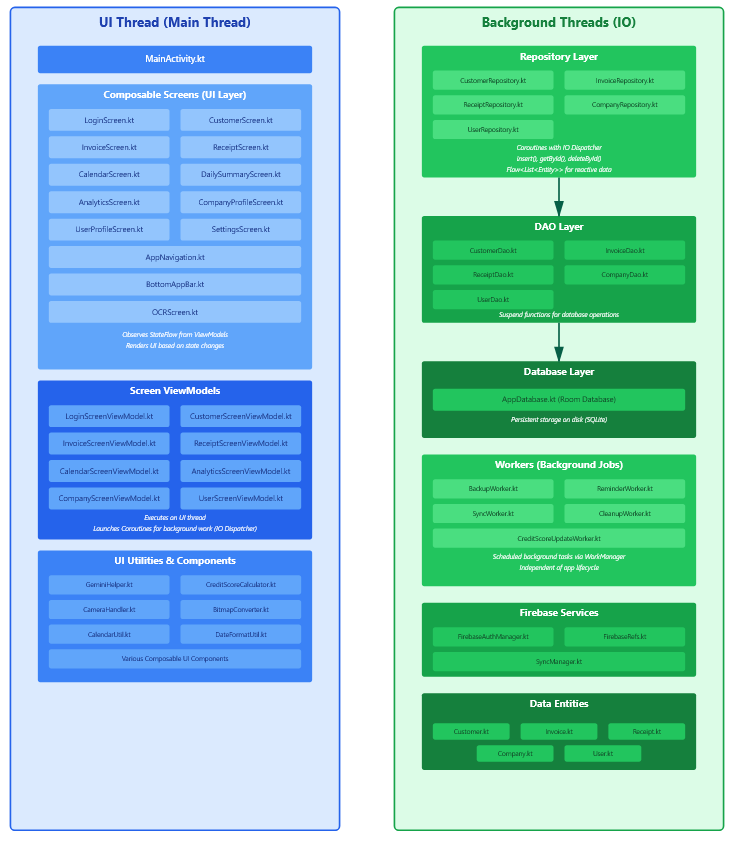

Android_EZcredit
---

## MVVM Architecture

This project follows the **MVVM (Model-View-ViewModel)** architecture for a clean and maintainable code structure.  

  

## Threading

This project actively involves using **Threads** for different UI and IO tasks.  

  

---

## Download APK

You can download the latest APK of the project here:  
[Download APK]([https://1drv.ms/u/c/a2e50b6392b4123e/ESVSOct-CntGnYsJraKw_H0BttE0P8dyy7iV7ycy_cjO4w?e=ZJbyXA](https://1drv.ms/u/c/931d74c7905f6350/IQC0ybSDx0AEQYFMSNEvQ1NMAa2oaHj9jSaq_yCUcGp78xc?e=EudZ1a)

---

## [Source Code](https://github.com/DakshArora07/Android_EZcredit)

---

## Demonstration of some of the project components
1. **Customers**  
   - Displays a list of customers along with their **credit scores**.  
   - Provides quick access to customer details and their transaction history.

2. **Invoices**  
   - Shows all invoices generated for customers.  
   - Includes invoice details, status (paid/unpaid), and due dates.

3. **Calendar**  
   - Displays a calendar view of scheduled tasks, events, or payments.  
   - Helps track deadlines and appointments efficiently.

4. **Analytics**  
   - Provides insights and analytics on customer activity, payments, and trends.  
   - Includes graphs and charts for easy visualization.

---

## Milestones for show_and_tell_1
1. **OCR (Optical Character Recognition) Setup**
   - Implemented OCR functionality to extract text from images.
   - Configured text extraction logic and ensured accurate parsing of recognized text for further use within the app.

2. **Gemini Integration**
   - Implemented logic for Gemini to determine whether an invoice is past its due date.
   - If an invoice is overdue, Gemini generates an appropriate alert or message to notify the user.

3. **Room Database setup**
   - Established a Room database for data storage and offline accessibility.
   - Created the necessary Entity, DAO, and Repository classes to manage invoice data efficiently in the later stages.
   - Implemented a clean architecture to maintain clear separation between data, domain, and presentation layers.

4. **UI Development**
   - Built UI screens for OCR scanning and viewing results.
   - Integrated the Calendar view in the UI to display invoices by date.

5. **Project Structure**
   - Organized code following MVVM architecture with ViewModel and utility classes for data handling.
   - Added utility and helper classes to support OCR, gemini integration, and date handling.
   - Maintained clear package organization for easier navigation and scalability.

---

## Milestones for show_and_tell_2
1. **UI/UX**​
   - Improved UI Screens (Customer, Invoice, Calendar, Analytics)​
   - Add/Delete/Edit customers and invoices from database​

2. **Database & Data​**
   - Improved Room Database functionality​
   - Filters and Sort methods for data
  
3. **OCR & Scanning​**
   - Improved OCR Scanning mechanism to scan actual invoices​
  
4. **Background Services​**
   - Work Schedular
   - Gemini Messaging​

5. **Cloud​**
   - Firebase real-time cloud sync
  
---

## Wokrload Distribution

Show and Tell 1 Contributions: 

- **Ayush Arora** – Contributed to UI development and app navigation, designing layouts and implementing smooth transitions between key sections of the application.

- **Daksh Arora** – Set up the Room Database, including entities, DAO, and repository classes, to enable efficient storage and retrieval of invoice/cusomer data.
  
- **Gurshan Singh Aulakh** – Focussed on Gemini integration in the app, enabling the app to send prompts to Gemini and handle the returned results.

- **Hetmay Ketan Vora** – Worked on UI design, navigation flow, and Calendar functionality, implementing the calendar feature and displaying the selected date when a day is clicked.

- **Henry Nguyen** – Developed the OCR functionality, enabling the extraction of text from invoice images captured through the camera.
  

Show and Tell 2 Contributions: 

- **Ayush Arora** – Contributed to UI, added WorkScheduler, improved Gemini integration, created a basic credit score algorithm and designed presentation slides and video.

- **Daksh Arora** – Improved the Room Database, added Firebase cloud database, enabled perfect synchronization using SyncManager and designed presentation slides and video.
  
- **Gurshan Singh Aulakh** – Focused on UI development, made the Invoice entry screen and Customer entry screen fully functional and created 2 modes (create and update).

- **Hetmay Ketan Vora** – Worked on UI design, made the calendar fully functional, designed the UI of analytics and designed presentation script and audio.

- **Henry Nguyen** – Refined OCR reading, formatted a paper invoice design, aligned the output of OCR with the invoice entry screen and designed the Thread diagram.

Future Workload Management:

- **Ayush Arora** - Will focus on developing the UI for Settings screen which will include the user profile, will improve credit score algorithm and background tasks. 
  
- **Daksh Arora** - Will integrate Firebase authentication for multi user setup, use the same for access permissions and work on the database entity of Receipts.
  
- **Gurshan Singh Aulakh** - Will finalize the UI for Invoices and Customers, add functionality of adding Customers through Invoice entry screen and will enable sorting.
  
- **Hetmay Ketan Vora** - Will improve the UI of calendar by adding manual reminder functionality and entry editing, will design analytics to include very robust reports.
  
- **Henry Nguyen** - Will work on the UI of Receipts and enable the integration of Receipts with Invoices to automatically settle amounts, will also work on OCR refinement.

