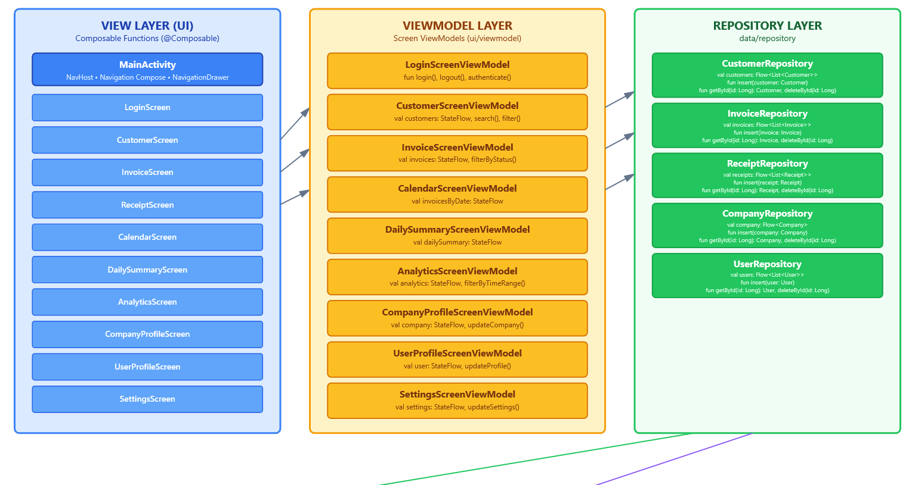
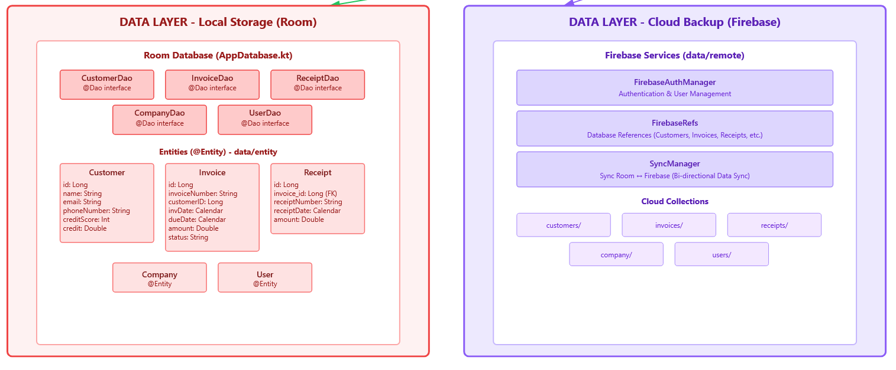

# 🌟 EZCredit
### Customer & Credit Management System  
*Android • Kotlin • Firebase • WorkManager • Stripe • OCR*

[](https://kotlinlang.org/)
[](https://developer.android.com/jetpack/compose)
[](https://firebase.google.com/)
[](https://developer.android.com/topic/libraries/architecture/workmanager)
[](https://stripe.com/)
[](https://developers.google.com/)

---

[**App APK**](https://1drv.ms/u/c/931d74c7905f6350/IQCX_EIrsBmaRox9XoGeLCiKAcH83JBc4J4O8bj23Aqzavo?e=7l6v94)

[**Final Presentation**](https://youtu.be/Gh9-xq7VQoU)

[**Source Code**](https://github.com/DakshArora07/Android_EZcredit)

---

## 🚀 Overview

[**Project pitch Link**](https://youtu.be/o5EsZg6VefA)

[**Show_and_Tell_1**](https://youtu.be/CRAPZDmeTiM)

[**Show_and_Tell_2**](https://youtu.be/5QegMo8JUec)

EZCredit is an Android application designed for small and mid-sized businesses to efficiently manage their daily financial operations.

The app provides a complete workflow that spans from:
- Creating and managing companies
- Adding multiple users with different access levels
- Handling customers and invoices
- Sending payment reminders
- Accepting payments through Stripe
- Automatically generating receipts
- Running background tasks for real-time updates
- Syncing data across multiple users and devices
  
The app supports multi-company and multi-user access, with all data synchronized live through Firebase and stored locally with Room for offline consistency.
Most advanced features—such as invoice sync, user management, payments, and background automation—require internet access, and the app will not start without it.

---

## 🔮 OCR
•⁠  ⁠Instant invoice data extraction with *OCR*  
•⁠  ⁠Autofill invoice fields from images or camera  

## 🤖 Automated
•⁠  ⁠5 background workers handle:
  - AI powered Email reminders  
  - Credit score updates  
  - Overdue invoices  
  - Paid/Late payment tracking  
  - Daily summaries  

## 📊 Insightful
•⁠  ⁠Dashboards & charts  
•⁠  ⁠Calendar view for invoices & payments  
•⁠  ⁠Customer credit history & analytics  

---

✨ Key Features

--- 

🏢 Multi-Company & Multi-User Support

•⁠ Create new companies directly from the app.

•⁠ Add users with different access levels (Admin, Sales, Receipts).

•⁠ Each company keeps its own isolated, real-time synchronized data.

•⁠ Switching companies updates the entire dataset instantly.

---

👤 User & Company Management

•⁠ Admins can update company details, add new users, or change access levels.

•⁠ Users can update their profile information (email, name, password).

•⁠ Access-based UI:
- Sales users: Customers & Invoices
- Receipts users: Receipts only
- Admin users: Full system access

---

📄 Smart Invoice Management

•⁠ Create invoices manually or using OCR extraction from images or camera.

•⁠ Auto-update statuses (Unpaid, Paid, PastDue, Late).

•⁠ Sort and filter invoices by status, due date, or customer.

•⁠ Edit and delete invoices anytime.

•⁠ Generate professional PDF invoices.

•⁠ Send email reminders with a payment link.

---

🔍 OCR (Optical Character Recognition)

•⁠ Extract invoice fields such as amount, dates, and customer info.

•⁠ Auto-populate invoice forms for faster data entry.

•⁠ Works with camera input and uploaded images.

•⁠ OCR strictly extracts text — no AI rewriting or hallucinations.

---

💰 Payments & Automated Receipts

•⁠ Customers can pay online using Stripe via the emailed payment link.

•⁠ Successful payments automatically generate receipts on the cloud.

•⁠ Receipts sync instantly across all users in the company.

•⁠ Manual receipt creation supported for in-person payments.

•⁠ Search and filter receipts by date, amount, or customer.

---

📊 Analytics Dashboard

•⁠ Admin users get insights into:
⁠- Amount collected
- Past-due trends
- Total outstanding amounts
- Customer credit performance

Filter analytics by week, month, or quarter.

---

📅 Calendar View

•⁠ View invoices on a calendar based on status (Paid, Unpaid, PastDue, Late).

•⁠ Apply multiple status filters at once.

•⁠ Quickly navigate invoice history at a glance.

---

# ⚙️ Background Automation (5 Workers)

• Worker: Function 
 - Auto Email Reminder: Sends daily payment reminders via Mailgun
 - Credit Score Update: Recalculates customer credit scores
 - Overdue Invoice: Marks invoices as PastDue
 - Paid / Late Payment: Matches receipts & updates invoice status
 - Daily Summary: Sends notifications with summary of invoices & credit changes

---

# 🧰 Tech Stack

## Frontend

-Language: Kotlin

-UI Framework: Jetpack Compose (Material 3)

-Architecture: MVVM + Clean Architecture

-State Management: StateFlow & Coroutines

-Background Tasks: WorkManager

-PDF Generation: iText + FileProvider

-OCR Processing: Gemini Messages

---

## Backend & Cloud

- Authentication: Firebase Auth
- Database: Firestore (NoSQL)
- Local Storage: Room Database
- File Storage: Firebase Storage
- Email Service: Mailgun API
- Payment Gateway: Stripe API
- AI Processing: Google Gemini 1.5 Flash

---

 🏗 Architecture & Project Structure

# EZCredit App Architecture

```text
┌─────────────────────────────────────┐
│ UI Layer (Jetpack Compose)          │
└──────────────┬──────────────────────┘
               │
               ▼
┌─────────────────────────────────────┐
│ StateFlow (State Management)        │
└──────────────┬──────────────────────┘
               │
               ▼
┌─────────────────────────────────────┐
│ ViewModel Layer                     │
└──────────────┬──────────────────────┘
               │ suspend functions
               ▼
┌─────────────────────────────────────┐
│ Repository Layer                     │
└──────────────┬──────────────────────┘
               │ IO Dispatcher
               ▼
┌─────────────────────────────────────┐
│ External Services                    │
│ Firebase • Stripe • Mailgun          │
└─────────────────────────────────────┘
```

## 📁 MVVM Architecture



## 📁 Threaded Architecture
 

## 📁 Cloud Database Structure
Firebase Realtime Database Structure (EZCredit)

┌─────────────────────────────────────────
│ ROOT                                                        
├─────────────────────────────────────────
│ companies/                                                  
│   ├─ {companyId}/                                          
│   │  ├─ users/                                             
│   │  │  ├─ {userId}/                                       
│   │  │  │  ├─ name: "John Doe"                             
│   │  │  │  ├─ email: "john@company.com"                    
│   │  │  │  ├─ companyId: 1                                 
│   │  │  │  ├─ accessLevel: "Admin"                         
│   │  │  │  ├─ lastModified: 1733100000000                  
│   │  │  │  └─ isDeleted: false                             
│   │  │  └─ {userId2}/...                                   
│   │  │                                                      
│   │  ├─ data/                                               
│   │  │  ├─ customers/                                       
│   │  │  │  ├─ {customerId}/                                 
│   │  │  │  │  ├─ name: "Acme Corp"                          
│   │  │  │  │  ├─ email: "billing@acme.com"                  
│   │  │  │  │  ├─ companyId: 1                               
│   │  │  │  │  ├─ lastModified: 1733100000000               
│   │  │  │  │  └─ isDeleted: false                          
│   │  │  │  └─ {customerId2}/...                            
│   │  │  │                                                   
│   │  │  ├─ invoices/                                        
│   │  │  │  ├─ {invoiceId}/                                  
│   │  │  │  │  ├─ invoiceNumber: "INV-001"                   
│   │  │  │  │  ├─ customerId: 123                            
│   │  │  │  │  ├─ amount: 2500.00                            
│   │  │  │  │  ├─ companyId: 1                               
│   │  │  │  │  ├─ lastModified: 1733100000000               
│   │  │  │  │  └─ isDeleted: false                          
│   │  │  │  └─ {invoiceId2}/...                             
│   │  │  │                                                   
│   │  │  └─ receipts/                                        
│   │  │     ├─ {receiptId}/                                  
│   │  │     │  ├─ receiptNumber: "AUTO_REC_001"              
│   │  │     │  ├─ invoiceId: "INV-001"                       
│   │  │     │  ├─ receiptDate: 1733100000000                
│   │  │     │  ├─ companyId: 1                              
│   │  │     │  ├─ lastModified: 1733100000000               
│   │  │     │  └─ isDeleted: false                          
│   │  │     └─ {receiptId2}/...                             
│   │  └─ {companyData}/...                                  
│   └─ {companyId2}/...                                      
└─────────────────────────────────────────


## 📁 Project Structure

```
EZCredit/
├── data/
│   ├── dao/           # 5 classes (data access objects)
│   ├── entity/        # Entity classes
│   ├── repository/    # 5 classes (repositories)
│   └── api/           # External API integrations (Mailgun, Stripe)
├── ui/
│   ├── screens/       # Compose screens
│   ├── viewmodel/     # 12 ViewModel classes
│   ├── components/    # Reusable UI components
│   └── theme/         # 3 theme classes (Material 3)
├── workers/           # 5 WorkManager workers
└── utils/             # Helpers (OCR, date utils, etc.)
```

# 👥 Team

• Developer: Role

- Ayush Arora:  UI, WorkManager logic, Credit Score algorithm, Email reminders 
- Daksh Arora: Room Database, Firebase sync, Firebase auth, Firebase functions, Payment gateway 
- Gurshan Singh Aulakh: Invoice & customer UI Screens, Automatic Email Background Worker, PDF Invoice Generation 
- Hetmay Vora: Calendar, Analytics, Login Screen, Company and User profile screens 
- Henry Nguyen: OCR engine, invoice formatting, receipt screen and project planning diagrams 

